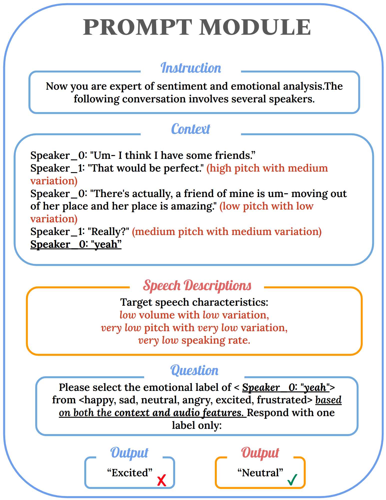

# SpeechCueLLM

[](https://paperswithcode.com/sota/emotion-recognition-in-conversation-on?p=2407-21315)

	
[](https://paperswithcode.com/sota/emotion-recognition-in-conversation-on-meld?p=2407-21315)

Accepted to NAACL 2025 Findings!

#### Abstract: 
We address the limitation of LLMs in processing audio inputs by translating speech characteristics into natural language descriptions. Our method integrates these descriptions into text prompts, enabling LLMs to perform multimodal emotion analysis without architectural modifications or addition. 

Our experiments reveal that incorporating speech descriptions leads to an improvement of over 3 points in the F1 score under the zero-shot setting **(from 45.19% to 48.3%)** and over 2.5 points under the LoRA setting on the IEMOCAP dataset **(from 70.111% to 72.596%)**.


<p align="center">
    
</p>

Figure 1: LLM Prompt Template for Emotion Detection: the last bold sentence with an underline is the target utterance. The orange part denotes outputs with added speech descriptions. This structured template integrates textual context and speech characteristics to guide the LLM in performing multimodal emotion analysis.

Paper link: https://arxiv.org/abs/2407.21315


## Extract Speech Features

#### Use Existing Features
You can also use the existing feature files in the speech_features folder.

#### Data Directory
To run our preprocessing codes directly, please download data and put into the data drirectory.

#### Run Extraction Code
1. extract basic speech features (adjust arguments based on the dataset)
    ```
    python feature_utils/extract_audio_feature.py
    ```
2. post-process the basic features (meld)
    ```
    python feature_utils/postprocess_audio_feature_meld.py
    ```

    or post-process the basic features (iemocap)
    
        python feature_utils/postprocess_audio_feature_iemocap.py
    

3. test the extracted features (adjust variables (dataset, classes) inside the main function)
    ```
    python model_audio_features.py
    ```

## LLM Modeling
Credit: We build our project on the foundation of [InstructERC](https://github.com/LIN-SHANG/InstructERC).

#### Environment setup:
1. create a new environment using python 3.8.10
2. install dependencies
    ```
    pip install torch==2.0.0+cu117 -f https://download.pytorch.org/whl/torch_stable.html
    cd env && pip install -r requirements.txt
    ```

#### Training
1. download LLMs from HuggingFace and store them in the LLM_bases folder
2. update the model path and adjust training parameters in train_and_inference_Uni.sh
3. start training
    ```
    cd LLM_code
    bash train_and_inference.sh
    ```
    The script will first run the ```data_process.py``` script which will process the pickle files from the ```original_data``` folder and create a new folder called ```PROCESSED_DATASET``` to store the inputs for LLMs. It will then run the training script which will create a new folder called ```experiemnts``` to store the training results.
    
    If you want to train projection-based models, you need to download the raw audio of the dataset and store them in the ```data``` folder.

#### New zero-shot results:
We discovered that repeating the question twice in the prompt (lines 201-206 of ```data_process.py```) results in a 10-point F1 improvement in the zero-shot setting for LLaMA3-Instruct. Given this finding, we have rerun the zero-shot experiments using LLaMA3-Instruct. However, we have yet to determine the underlying cause of this improvement. If you uncover any insights, please let us know!
| Seed   | Text | Text+audio description |
|--------|------------|---------------|
|1|45.07 |47.22|
|11|45.37	|48.42|
|42|45.14	|49.25|
|||
|Avg|45.19	|48.3|
